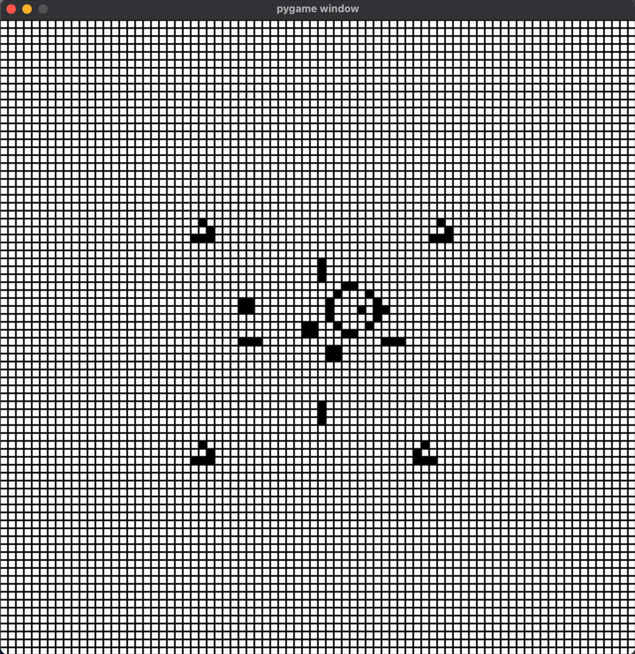

# 🧬 Game of Life - Python

<p align="center">
  
</p>

---

## Project Overview

**Conway’s Game of Life** is a zero-player cellular automaton invented by mathematician **John Conway**.  
The simulation evolves over discrete time steps, following simple rules that give rise to surprisingly complex and beautiful patterns.

This implementation focuses on:
- Clean, visual evolution of the grid using **Pygame**
- A **naive cell-update algorithm** (simple nested loops for clarity)
- Support for **preset patterns** like gliders, blinkers, and glider guns
- A **scrolling, colorful grid view** for aesthetic demonstrations

---

## Simulation Rules

Each cell lives on a 2D grid and can be either **alive (1)** or **dead (0)**.  
At every generation, the following rules apply:

| Condition | Result |
|------------|--------|
| Fewer than 2 live neighbors | Dies (underpopulation) |
| 2 or 3 live neighbors | Survives |
| More than 3 live neighbors | Dies (overpopulation) |
| Exactly 3 live neighbors | Becomes alive (reproduction) |

---

## Current Features

- **Naive Evolution Algorithm** (nested loops for simplicity)
- **Multiple preset patterns** for demos:
  - `pattern1` – Simple gliders and blinkers  
  - `pattern2` – Randomized field  
  - `pattern3` – Collision-rich pattern  
  - `pattern4` – Center-origin evolving pattern (never dies)
- **Grid rendering with Pygame** (alive cells filled, outlined with borders)
- **Pause / Resume / Step controls** (optional)
- Perfect for **GitHub demo videos** or visualization projects

---

## Planned Improvements

- **Hashlife optimization** for massive grids and faster evolution
- **Pattern editor** (place live cells manually)
- **Save & load pattern files**
- **Smooth color transitions** for cell aging
- **Audio visualization** (cells drive sound effects)

---

## File Structure

| File | Description |
|------|--------------|
| `main.py` | Main entry point; initializes the window and runs the loop. |
| `patterns.py` | Contains predefined patterns (e.g., pattern1–pattern4). |
| `Board.py` | Grid logic: updating, drawing, and applying rules. |
---

## How to Run

### 1. Install Dependencies
```bash
pip install pygame
